# Application Web de Gestion des Produits

## Objectif
Créer une application Web JEE basée sur Spring Boot permettant de gérer des produits.  

L'application utilise les technologies suivantes :

- Spring Boot
- Spring Data JPA
- Hibernate
- Thymeleaf
- Spring Security
- Bootstrap

# 1. Création du projet Spring Boot

Nous avons créé un projet Spring Boot avec les dépendances suivantes :

- Spring Web
- Spring Data JPA
- H2 Database
- MySQL
- Thymeleaf
- Lombok
- Spring Security
- Spring Validation
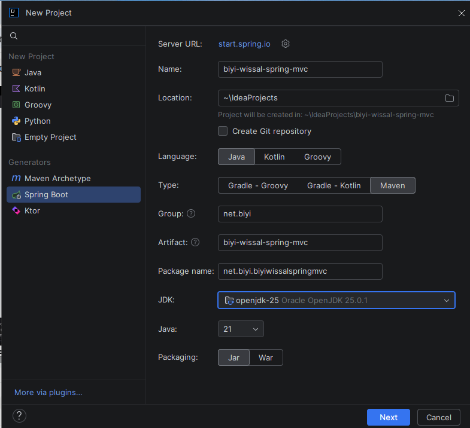

# 2. Création de l'entité JPA Product
Création de l'entité Product avec les attributs :

- id
- name
- price
- quantity

Cette entité est annotée avec les annotations JPA.
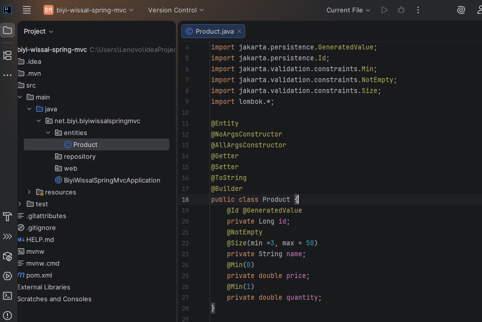

3. Création du Repository

Création de l'interface ProductRepository basée sur Spring Data JPA.

Cette interface permet d'effectuer les opérations CRUD sur la base de données.

# 4. Test de la couche DAO

Test de la couche DAO au démarrage de l'application pour vérifier :

- L'ajout des produits
- L'affichage des produits

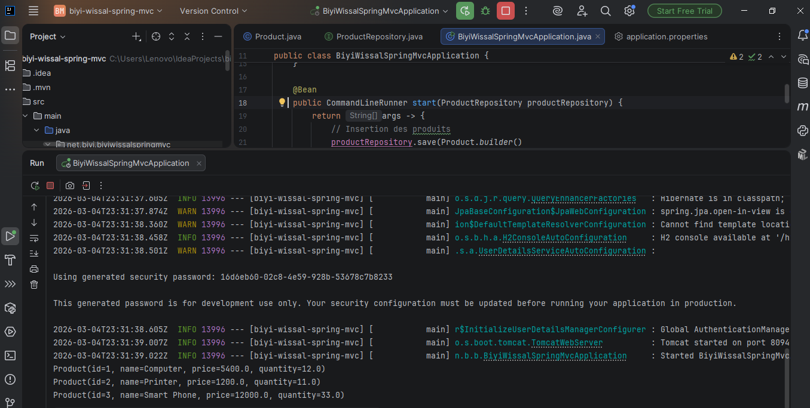
- login
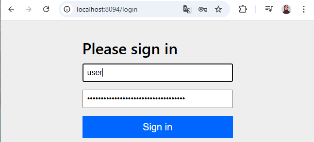

# 5. Désactivation de la sécurité par défaut

Au début du projet, la sécurité par défaut de Spring Security a été désactivée pour permettre le développement de l'application.

# 6. Création du contrôleur et des vues

Création du contrôleur Spring MVC pour gérer les actions suivantes :

- Afficher la liste des produits
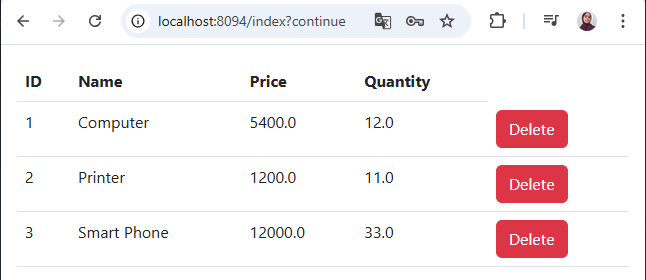
- Supprimer un produit
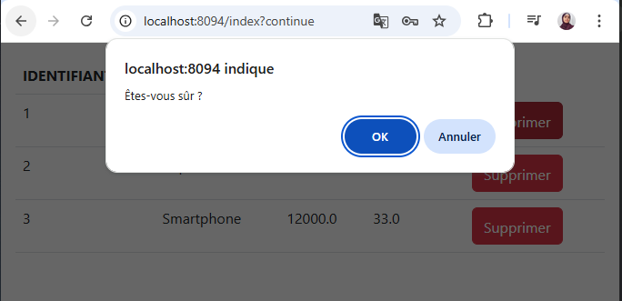
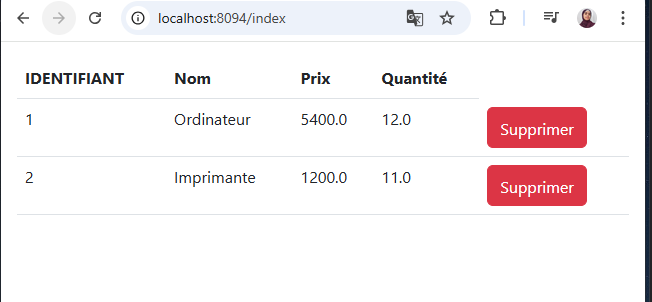
- Ajouter un produit
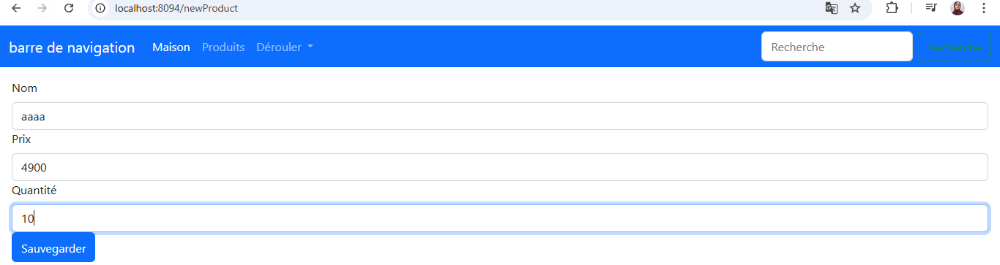
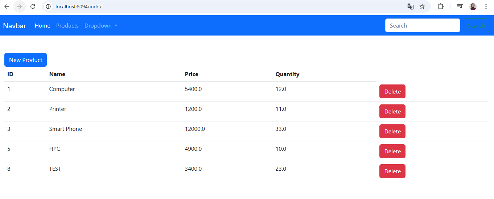
## 7. Sécurisation de l'application

L'application est sécurisée avec Spring Security.  
Après authentification, le nom de l'utilisateur apparaît dans la barre de navigation avec un menu déroulant permettant de se déconnecter.

### Barre de navigation avec utilisateur connecté
Admin
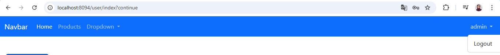
User1
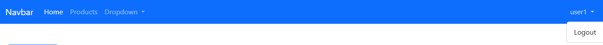

L'application est sécurisée avec Spring Security.

Deux rôles sont définis :

### USER
- Peut consulter la liste des produits
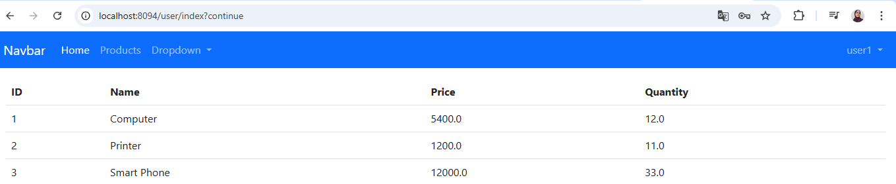

### ADMIN
- Peut consulter les produits
- Peut ajouter un produit
- Peut supprimer un produit
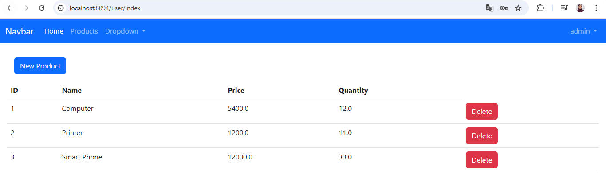
### Accès refusé pour un utilisateur USER

Lorsqu'un utilisateur ayant le rôle USER tente d'accéder à une page réservée à l'administrateur (par exemple : ajouter un produit), l'application affiche une page "Not Authorized".
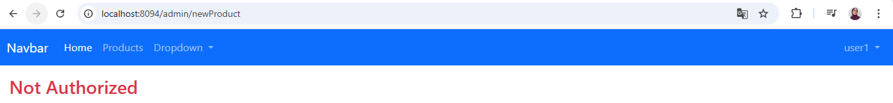

## 8. Fonctionnalités supplémentaires

Afin d'améliorer l'application, plusieurs fonctionnalités supplémentaires ont été ajoutées.

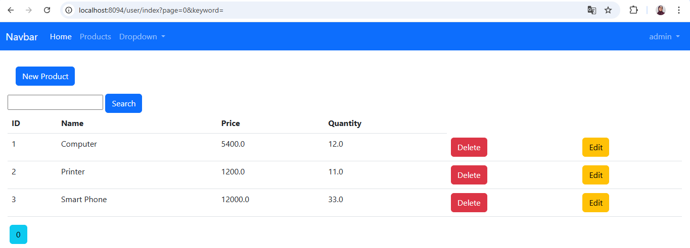
### 1. Recherche des produits

Une barre de recherche a été ajoutée permettant de filtrer les produits par nom.

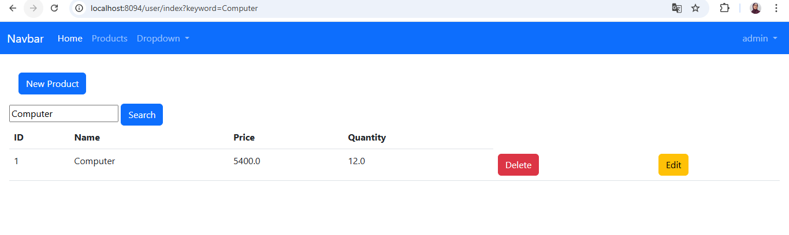

### 2. Edition et mise à jour d'un produit

L'administrateur peut modifier les informations d'un produit existant.

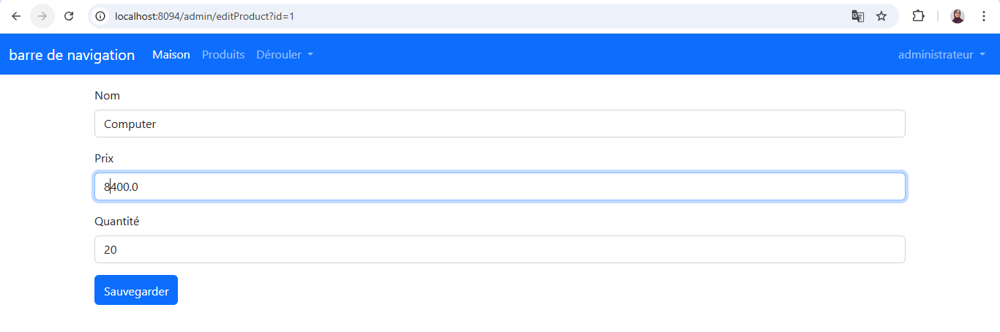

## Conclusion

Ce projet nous a permis de comprendre le fonctionnement du framework Spring Boot et de ses composants principaux comme Spring MVC, Spring Data JPA et Spring Security pour développer une application web sécurisée.

